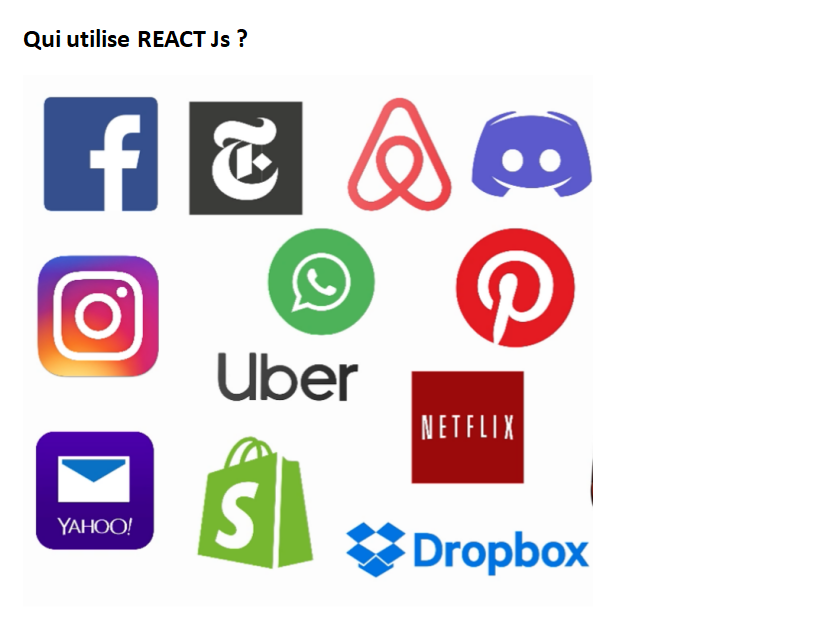
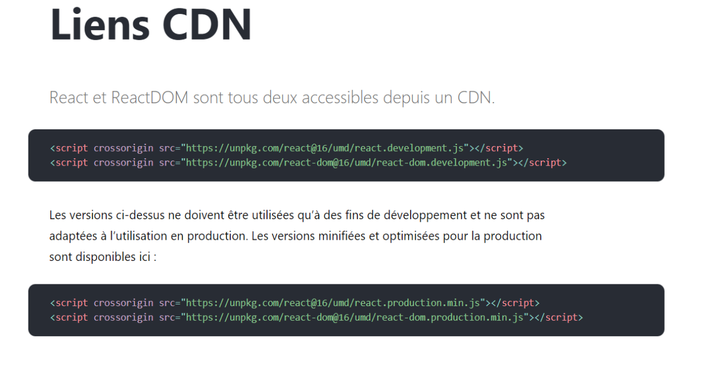

### Pourquoi REACT ?

React.js est une bibliothèque JavaScript développée par les ingénieurs de Facebook. Voici quelques-unes des raisons pour lesquelles les gens choisissent de programmer avec React :

- Bibliothèque JavaScript : Une bibliothèque JavaScript est un ensemble de fonctions prédéfinies et de routines qui peuvent être utilisées pour effectuer des tâches spécifiques. Elle se concentre généralement sur des fonctionnalités spécifiques, telles que la manipulation du DOM, les appels AJAX, la gestion des événements, etc. Elle offre une flexibilité plus grande et vous permet de choisir les fonctionnalités que vous souhaitez utiliser dans votre application. Vous pouvez intégrer une bibliothèque JavaScript dans votre code existant sans avoir à adopter l'architecture de la bibliothèque.
- Framework JavaScript : Un Framework JavaScript est une infrastructure logicielle plus complète qui fournit une structure et une méthodologie pour développer des applications JavaScript. Il offre un ensemble de règles, de conventions et de composants prédéfinis qui facilitent le développement d'applications cohérentes et évolutives. Un framework JavaScript comprend généralement une bibliothèque de base avec des fonctionnalités étendues, ainsi qu'une architecture prédéfinie et un cycle de vie d'application spécifique. Il dicte souvent l'organisation du code, la manière de gérer les données, les modèles de conception à suivre, etc.

* React est *rapide* . Les applications créées dans React peuvent gérer des mises à jour complexes tout en restant rapides et réactives.
* React est *modulaire* . Au lieu d'écrire des fichiers de code volumineux et denses, vous pouvez écrire de nombreux fichiers plus petits et réutilisables. La modularité de React peut être une belle solution aux problème de maniabilité de JavaScript .
* React est *évolutif* . Les grands programmes qui affichent de nombreuses données changeantes sont ceux où React fonctionne le mieux.
* React est *flexible* . Vous pouvez utiliser React pour des projets intéressants qui n'ont rien à voir avec la création d'une application Web. Les gens sont encore en train de comprendre le potentiel de React. il y a de la place a explorer
* React est *populaire* . Même si cette raison n'a certes pas grand-chose à voir avec la qualité de React, la vérité est que comprendre React vous rendra plus employable.

  

# Premiers pas avec REACT

Documentation dispo sur le site : [https://fr.reactjs.org/]()

Nous allons récupérer les différents lien CDN afin de commencer à travailler avec REACT

**Pourquoi deux liens :**

- Le 1er lien est propre à la biblithèque REACT Js et c’est celui-ci qui permet de créer des objets REACT
- Le second lui permet à notre bibliothèque REACT de se connecter au DOM

A savoir : Si vous développez une appli en RECAT native par exemple, nous n'aurez pas besoin de la connexion au DOM
