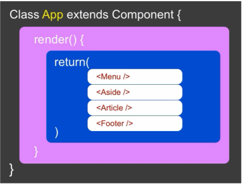
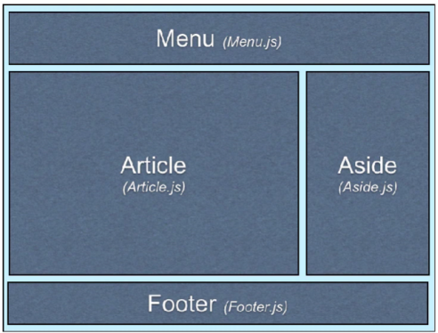
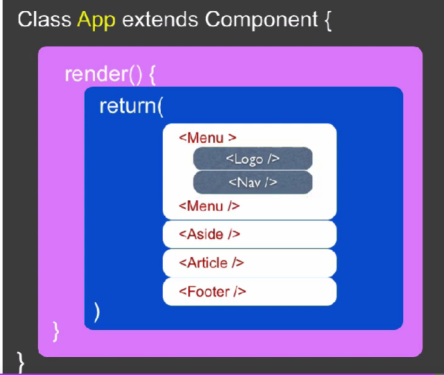
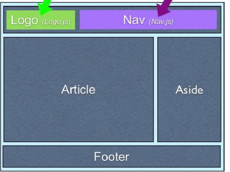
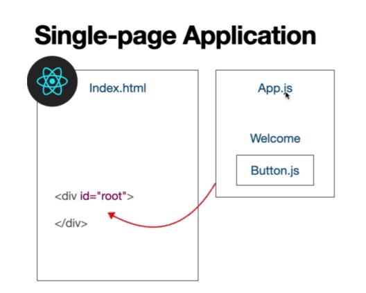
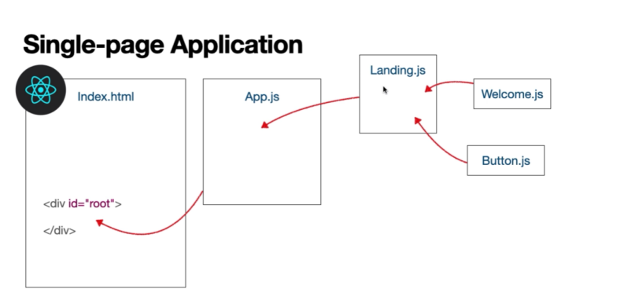
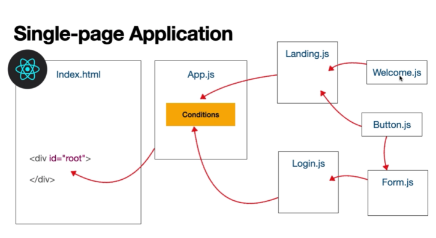

### Composants de REACT

Les applications React sont constituées de **composants.**

Qu'est-ce qu'un composant ?

Un composant est un petit morceau de code réutilisable responsable d'une tâche. Ce travail consiste souvent à restituer du JSX et à le restituer lorsque certaines données changent.

Jetez un œil au code ci-dessous. Ce code créera et restituera un nouveau composant React :

```
import React from 'react';
import ReactDOM from 'react-dom';

function MyComponent() {
  return <h1>Hello world</h1>;
}

ReactDOM.createRoot(
document.getElementById('app')
).render(<MyComponent />);

```

### Créer un composant de fonction

Nous avons dit qu'*composant React* est un petit morceau de code réutilisable qui est responsable d'une tâche, qui implique souvent le rendu JSX et son nouveau rendu chaque fois que certaines données changent.

Il est utile de considérer les composants comme des éléments plus petits de notre interface. Ensemble, ils constituent les éléments constitutifs d'une application React. Dans un site Web, nous pouvons créer un composant pour la barre de recherche, un autre composant pour la barre de navigation et un autre composant pour le contenu du tableau de bord lui-même.



RENDU (DOM) :



Un composant peut également contenir lui aussi des composants (imbriqué) :



Qui aura donc cette vue :



Voici un autre fait sur les composants : nous pouvons utiliser des fonctions JavaScript pour définir un nouveau composant React. C'est ce qu'on appelle un **composant fonctionnel** .

Dans le passé, les composants React étaient définis à l'aide de classes Javascript. Mais depuis l'introduction des Hooks(quelque chose dont nous parlerons plus tard), les composants fonctionnels sont devenus la norme dans les applications React modernes.

Après avoir défini notre composant fonctionnel, nous pouvons l'utiliser pour créer autant d'instances de ce composant que nous le souhaitons.

Regardons l'exemple du premier exercice :

```
import React from 'react';

function MyComponent() {
  return <h1>Hello, I'm a functional React Component!</h1>;
}

export default MyComponent;
```

Sur la troisième ligne, une fonction est définie avec le nom `MyComponent`. À l'intérieur, la fonction renvoie un élément React dans la syntaxe JSX:

```
return <h1>Hello, I'm a functional React Component!</h1>;
```

Combiné, cela constitue un composant fonctionnel de base de React.

Sur la dernière ligne du bloc de code ci-dessus, `MyComponent`est exporté afin de pouvoir être utilisé ultérieurement.

Les noms des composants de fonction doivent commencer par une majuscule et sont classiquement créés avec PascalCase ! En raison de la manière dont les balises JSX sont compilées, la mise en majuscule indique qu'il s'agit d'un composant React plutôt que d'une balise HTML.

Il s’agit d'une nuance spécifique à React ! Si vous créez un composant, assurez-vous de le nommer en commençant par une lettre majuscule afin qu'il l'interprète comme un composant React. S'il commence par une lettre minuscule, React commencera à rechercher un composant intégré tel que `div` et `input` à la place et échouera.

### Le mot-clé de retour dans les composants fonctionnels

Lorsque nous définissons un composant fonctionnel, nous définissons essentiellement une usine capable de créer la combinaison appropriée d'éléments chaque fois que nous faisons référence à son nom. Il le construit en consultant un ensemble d'instructions que vous devez fournir.

Si vous pensez : « Cela ressemble exactement à l'utilité d'une fonction Javascript classique », alors vous avez raison ! Les composants fonctionnels peuvent être pensés dans une veine très similaire aux fonctions Javascript classiques, sauf que leur travail consiste à assembler une partie de l'interface en fonction des instructions données !

Parlons un peu plus de ces instructions.

Pour commencer, ces instructions doivent prendre la forme d'un corps de déclaration de fonction. Cela signifie qu'ils seront délimités par des accolades, comme ceci :

```
function Button() {
  // Instructions go here, between the curly braces.
}
```

Nos instructions peuvent inclure une combinaison de balisage, CSS et JavaScript pour produire le résultat souhaité. La seule chose que nous devons toujours inclure est une instruction **return** .

La fonction devrait produire du code JSX qui peut être utilisé pour afficher quelque chose sur l'écran du navigateur. Ainsi, lorsque nous définissons des composants fonctionnels, nous devons renvoyer un élément JSX.

```
function BackButton() {
 return <button>Back To Home</button>;
}

```

Bien sûr, cela ne s'affiche pas encore `<button>Back To Home</button>` sur l'écran du navigateur. Nous avons seulement défini notre composant.

Continuons pour voir comment restituer le composant et pourquoi l'instruction return est nécessaire !

### Importation et exportation de composants React

Il nous reste encore un peu de travail à faire avant de pouvoir utiliser notre composant défini et le rendre sur le DOM.

React possède généralement deux fichiers principaux: 

**- App.js** et **index.js** . **Le fichier App.js** est le niveau supérieur de votre application et **index.js** est le point d'entrée.

En HTML on serait directement intervenu sur index.html.

En React s'est différent :



Jusqu'à présent, nous avons défini le composant à l'intérieur de **App.js** , mais comme **index.js** est le point d'entrée, nous devons l'exporter vers **index.js** pour le rendu.

Les composants de React sont excellents car ils sont réutilisables. Nous pouvons garder nos composants séparés, organisés et réutilisables en les plaçant dans des fichiers séparés et en les exportant là où nous en avons besoin.

REACT nous permet aussi d'externaliser d’autres éléments afin de pouvoir les réutiliser à souhait



Pour les exporter, nous pouvons le préfixer avec la déclaration `export` et préciser s'il s'agit d'une exportation par défaut ou nommée. Dans ce cas, nous nous en tiendrons à `default`. 

Après la définition du composant de fonction, dans **App.js** , nous pouvons exporter par défaut notre composant comme ceci :

```
export default MyComponent;
```

Grace à la méthode des imports/export

React permet d'éditer des applications plus complexes :



Nous pouvons nous diriger vers notre fichier **index.js** pour importer notre composant depuis `'./App'`:

```
import MyComponent from './App';
```

### Utilisation et rendu d'un composant

Maintenant que nous avons un composant fonctionnel défini, nous pouvons commencer à l'utiliser.

Nous pouvons l'utiliser avec une syntaxe de type HTML qui ressemble à une balise à fermeture automatique :

```
<MyComponent />
```

Si vous devez imbriquer d'autres composants entre les deux, vous pouvez également utiliser une structure de balises d'ouverture et de fermeture correspondante :

**`<MyComponent>`**
  `<OtherComponent />`
`</MyComponent>`

Cependant, pour rendre notre composant au navigateur, nous devons nous appuyer sur les méthodes `.createRoot()`et `.render()`de la `react-dom`bibliothèque. Cela devrait être fait dans notre point d'entrée, **index.js** .

Tout d’abord, nous appelons la `createRoot`méthode pour créer un conteneur racine React pour afficher le contenu. Les applications React ont généralement un seul nœud DOM racine et tout ce qu'il contient est géré par React DOM.

En d'autres termes, nous donnons `createRoot`un élément DOM à restituer et React se chargera de gérer le DOM à l'intérieur.

Voici un exemple :

<pre class="styles_pre__Vzth4"><pre class="gamut-it1bt3 e1aon2sq0"><code><div data-lang="codecademy-js" class="gamut-13bvm8t e5rxebe0"><span><span class="mtk9">ReactDOM</span><span class="mtk1">.</span><span class="mtk10">createRoot</span><span class="mtk1">(</span><span class="mtk9">document</span><span class="mtk1">.</span><span class="mtk10">getElementById</span><span class="mtk1">(</span><span class="mtk8">'app'</span><span class="mtk1">));</span></span><br/><span><span></span></span><br/></div></code></pre></pre>

Super! Décomposons-le un peu plus :

* `document.getElementById('app')`renvoie un élément DOM de **index.html** .
* `.createRoot()`reçoit l'élément DOM comme premier argument et crée une racine pour celui-ci.
* `.createRoot()`renvoie une référence au conteneur racine sur lequel vous pouvez appeler des méthodes comme `.render()`.

Une fois la racine créée, il ne reste plus qu'à appeler la `.render()`méthode sur la racine renvoyée et afficher le composant React comme ceci :

<pre class="styles_pre__Vzth4"><pre class="gamut-it1bt3 e1aon2sq0"><code><div data-lang="codecademy-js" class="gamut-13bvm8t e5rxebe0"><span><span class="mtk9">ReactDOM</span><span class="mtk1">.</span><span class="mtk10">createRoot</span><span class="mtk1">(</span><span class="mtk9">document</span><span class="mtk1">.</span><span class="mtk10">getElementById</span><span class="mtk1">(</span><span class="mtk8">'app'</span><span class="mtk1">)).</span><span class="mtk10">render</span><span class="mtk1">(</span><span class="mtk4"><MyComponent /></span><span class="mtk1">);</span></span><br/><span><span></span></span><br/></div></code></pre></pre>

À partir de là, React s'affichera `<MyComponent />`à la racine et le fera apparaître à l'écran.

Dans une application entièrement construite avec React, vous n'aurez besoin de le faire qu'une seule fois. Une fois cela configuré, React gérera le DOM de votre application et toutes les mises à jour de l'interface utilisateur seront prises en charge efficacement. **L'ajout de composants supplémentaires doit avoir lieu dans votre fichier App.js** de niveau supérieur .
