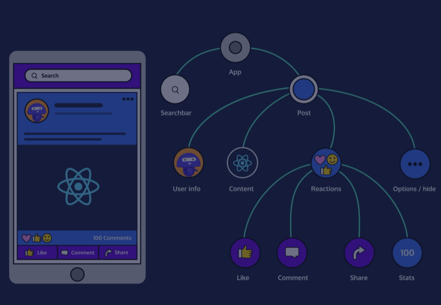

### Les composants interagissent

Une application React peut contenir des dizaines, voire des centaines de composants.

Chaque composant peut être petit et relativement banal en soi. Cependant, lorsquils sont combinés, ils peuvent former dénormes écosystèmes d'informations d'une complexité fantastique.

En d'autres termes, les applications React sont constituées de composants, mais ce qui rend React spécial, ce ne sont pas les composants eux-mêmes. Ce qui rend React spécial, ce sont la manière dont les composants *interagissent* .

Cette leçon est une introduction aux *composants qui interagissent* . Après cette leçon, vous devriez être familier avec :

* comment les composants peuvent référencer d'autres composants.
* comment cela nous permet de séparer nos composants dans des fichiers séparés.

